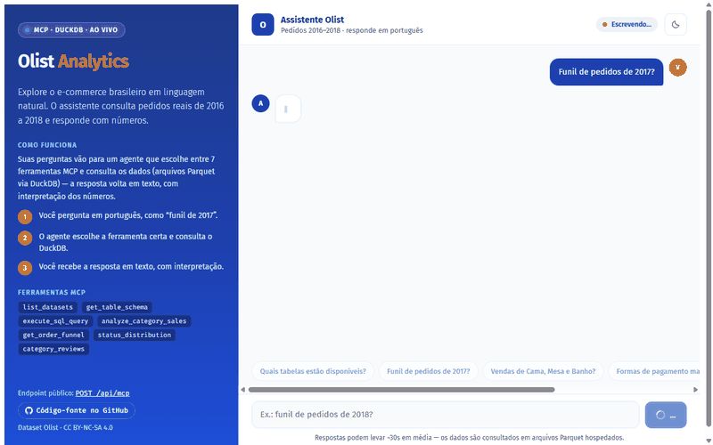
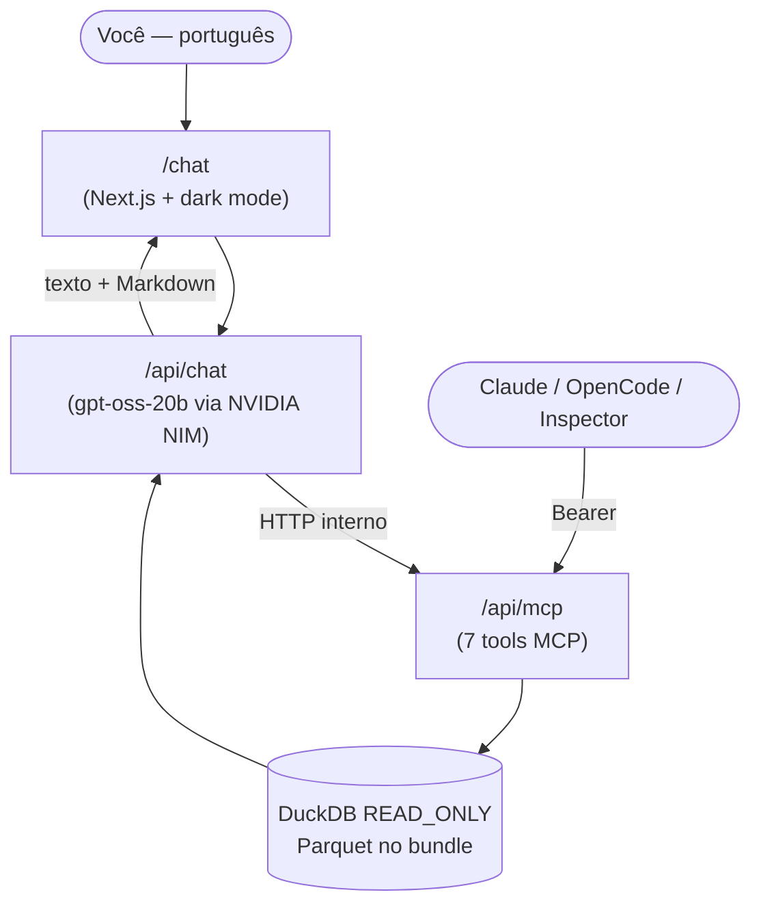

# olist-mcp — E-commerce brasileiro consultável em linguagem natural

[](https://nextjs.org/)
[](https://www.typescriptlang.org/)
[](https://duckdb.org/)
[](https://modelcontextprotocol.io/)
[](https://olist-mcp.vercel.app/chat)
[](#)

> ### 🟢 Live Demo
>
> ## [💬 Abrir o chat: olist-mcp.vercel.app/chat](https://olist-mcp.vercel.app/chat)
>
> Pergunte em português, por exemplo **"Funil de pedidos de 2017?"** — o agente
> consulta ~100 mil pedidos reais e responde com números em ~10 segundos.



## O que é

O dataset público da **Olist** (e-commerce brasileiro, 2016–2018: pedidos,
itens, produtos, clientes, avaliações, pagamentos e vendedores) exposto de dois
jeitos:

1. **Chat em linguagem natural** (link acima) — um agente LLM traduz perguntas
   em consultas e responde com tabelas e interpretação, inclusive traduzindo
   nomes amigáveis ("Cama, Mesa e Banho" → `bed_bath_table`).
2. **Servidor MCP** (`POST /api/mcp`, Streamable HTTP + Bearer) — qualquer
   agente compatível (Claude, OpenCode, Inspector) pode plugar as mesmas
   7 ferramentas.

## Por que é interessante

- **Agente com ferramentas reais**: loop LLM → tool-calls → SQL, com correção
  automática (typo de categoria retorna sugestões; `truncated` orienta a
  refinar em vez de chutar totais).
- **Serverless de verdade**: DuckDB roda dentro da Lambda Vercel sobre
  Parquet empacotado — catálogo em `/tmp`, modo `READ_ONLY`, configuração
  travada, sem banco externo e sem custo fixo.
- **Guardrails levados a sério**: só `SELECT`/`WITH`, máx. 100 linhas por
  consulta, timeout com `interrupt()`, erros sanitizados (`isError`, sem vazar
  paths), comentários de reviews tratados como texto não-confiável.
- **Latência caçada com benchmark**: o primeiro modelo (~35s/geração)
  estourava o limite de 60s da função; após medir 6 candidatos, a troca
  reduziu o turno de **124s para ~10s** em produção.
- **Testes sobre dados reais** (37, todos verdes): funil monotônico,
  `receita + frete == bruto`, dedup de reviews, serialização de `BigInt`.

## Arquitetura



## Números do dataset

| Dado | Valor |
|------|-------|
| Pedidos em 2017 (funil completo) | 45.101 |
| Avaliações de clientes | 99.224 |
| Categorias de produto | 73 (com nomes amigáveis em PT-BR) |
| Tabelas / tools MCP | 7 |
| Período coberto | 2016–2018 |

## As 7 tools

| Tool | Faz o quê |
|------|------------|
| `list_datasets` | Lista as 7 tabelas |
| `get_table_schema` | Colunas + chaves + relacionamentos + notas semânticas |
| `execute_sql_query` | SQL DuckDB read-only (≤100 linhas) |
| `analyze_category_sales` | Receita + frete + bruto por categoria |
| `get_order_funnel` | Funil comprado→aprovado→enviado→entregue por ano |
| `get_order_status_distribution` | Status final dos pedidos por ano |
| `analyze_category_reviews` | Nota média + comentários recentes por categoria |

## Desenvolvimento

### Pré-requisitos

- **Node 24 + npm** (sem pnpm) e **Python 3** com `pandas`/`pyarrow` (só para o ETL).
- Shell documentado em PowerShell 5.1 (Windows).

### Variáveis de ambiente

| Var | Onde | Para quê |
|-----|------|----------|
| `MCP_API_KEY` | `.env.local` + Vercel (Preview e Production, Secret) | Bearer do `/api/mcp` e do hop interno do chat |
| `NVIDIA_API_KEY` | `.env.local` + Vercel (Production, Secret) | LLM do chat via NVIDIA NIM |
| `NIM_MODEL` | `.env.local` + Vercel (Production) | Modelo do chat (atual: `openai/gpt-oss-20b`) |
| `OLIST_CSV_DIR` | só local, só p/ ETL | Pasta com os 9 CSVs do Kaggle |

> Secrets da Vercel **não podem ser lidos de volta** (aparecem como
> `[SENSITIVE]`): se perder uma chave, rotacione com
> `vercel env add NOME <env> --force` + redeploy.

### Rodar local

```powershell
$env:MCP_API_KEY = "dev-key-123"   # qualquer valor; sem ela tudo dá 401
npm install
npm run dev                        # chat em http://localhost:3000/chat
```

### Verificação

```powershell
npm test                            # todos (37, sobre dados reais)
npx vitest run tests/<arquivo>      # focado, ex.: tests/tools.test.ts
npm run typecheck                   # tsc --noEmit (strict + noUncheckedIndexedAccess)
npm run build                       # build Next/Turbopack de produção
```

Smoke do MCP no caminho HTTP real (precisa do dev rodando):

```powershell
$env:MCP_API_KEY="dev-key-123"; node scripts/smoke-mcp.mjs [url]
```

Testes MCP usam `InMemoryTransport.createLinkedPair()` + `Client` oficial —
não chame o envelope do protocolo na mão.

### OpenCode

`opencode.json` já aponta para a produção (`olist-local` desabilitado).
Sempre `{env:MCP_API_KEY}` — nunca `${MCP_API_KEY}` (vira literal e dá
401 falso). Modelo do agente: `meta/llama-3.3-70b-instruct`.

### ETL (gera os Parquets)

```powershell
python scripts/etl_olist.py --csv-dir <pasta com os 9 CSVs de olistbr/brazilian-ecommerce>
```

Gera `data/<tabela>/part-0000.parquet` + `src/generated/manifest.ts` +
`lib/db/categories.ts` (**gerado — não editar à mão**; o de-para amigável
vive em `lib/db/category-labels.ts`, manual). CSVs devem ser abertos com
`encoding="utf-8"`, timestamps são naive (serialização ISO sem `Z`).

### Estrutura

```text
app/api/mcp/route.ts    # servidor MCP (Streamable HTTP, Bearer)
app/api/chat/route.ts   # chat: LLM (NIM) + tools MCP via HTTP interno
app/chat/               # UI do chat (CSS puro com tokens, dark mode)
lib/mcp/server.ts       # as 7 tools (resolveCategory, guard, envelope)
lib/db/                 # DuckDB (singleton /tmp + READ_ONLY), guard, serialize, metadata
lib/db/category-labels.ts # de-para slug EN → PT → rótulo amigável (manual)
data/<tabela>/          # Parquets (vão no bundle da Lambda)
scripts/etl_olist.py    # Kaggle CSVs → Parquet + manifest + categories
tests/                  # 37 testes vitest sobre dados reais
```

### Deploy (Vercel, manual)

Push na `main` + (sem auto-deploy: git nunca vinculado no dashboard):

```powershell
vercel deploy --prod --scope damorim77s-projects   # o --scope é obrigatório
```

Detalhes que já morderam: Parquets e `libduckdb.so` sobem via
`outputFileTracingIncludes`; catálogo DuckDB em `/tmp` (`READ_ONLY`,
allowlist + config travada); Lambda sem `HOME` (tudo em `/tmp`); proteção
SSO desligada via API — o gate é o Bearer. Inspector MCP: transporte
`streamable-http`, era **Modern** + header `Authorization`.

Arquitetura e decisões em [`docs/PLAN.md`](docs/PLAN.md); status executivo
em [`docs/PROGRESS.md`](docs/PROGRESS.md) (a `SPEC` está desatualizada).

## Licença dos dados

`data/*` deriva do [Brazilian E-Commerce Public Dataset by Olist
(Kaggle)](https://www.kaggle.com/datasets/olistbr/brazilian-ecommerce) —
**CC BY-NC-SA 4.0** (ver `data/LICENSE-ATTRIBUTION.md`): atribuição + **uso
não-comercial** + mesma licença.
